# DevOps Flask Application Deployment

## Agentic AI Workflow

```mermaid
graph LR
    subgraph "Input Processing"
        IT[Input Trigger] --> PP[Prompt Processing]
        PP --> TC[Task Classification]
    end

    subgraph "Cognitive Layer"
        TC --> PL[Planning]
        PL --> RA[Reasoning & Analysis]
        RA --> DM[Decision Making]
    end

    subgraph "Action Layer"
        DM --> TE[Task Execution]
        TE --> FD[Feedback & Debugging]
        FD --> AA[Action Adjustment]
    end

    subgraph "Output Layer"
        AA --> RG[Response Generation]
        RG --> QC[Quality Control]
        QC --> FO[Final Output]
    end

    style IT fill:#f9f,stroke:#333,stroke-width:2px
    style FO fill:#9ff,stroke:#333,stroke-width:2px
    style PL fill:#ff9,stroke:#333,stroke-width:2px
    style RA fill:#ff9,stroke:#333,stroke-width:2px
    style DM fill:#ff9,stroke:#333,stroke-width:2px
```

This project demonstrates a production-ready Flask application deployment using modern DevOps practices. The solution uses Minikube for local development but is designed to be cloud-native and extensible for AWS production deployments.

## How It Works

### Application Structure

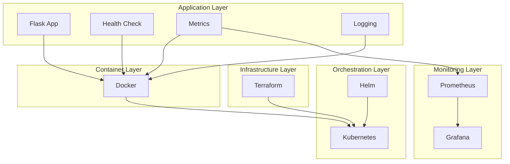

### Component Breakdown

1. **Flask Application**
   - Simple web application with health endpoints
   - Metrics endpoint for Prometheus
   - Configurable via environment variables
   - Logging middleware for request tracking

2. **Docker Container**
   - Multi-stage build for optimization
   - Non-root user for security
   - Health check configuration
   - Environment variable support

3. **Kubernetes Resources**
   - Deployment for pod management
   - Service for network access
   - ConfigMap for configuration
   - Secrets for sensitive data

4. **Helm Charts**
   - Templated Kubernetes manifests
   - Environment-specific values
   - Dependency management
   - Release versioning

## Deployment Process

### 1. Local Development

```bash
# Start Minikube
minikube start

# Enable required addons
minikube addons enable ingress
minikube addons enable metrics-server

# Build and deploy application
task setup                  # Install required tools
task docker:build          # Build Docker image
task deploy ENV=dev        # Deploy to dev environment

# Install monitoring stack
task monitoring:install ENV=dev
```

### 2. Verify Deployment

#### Check Application Status
```bash
# Verify pods are running
kubectl get pods -n dev

# Check application logs
kubectl logs -n dev -l app=flask-app

# Test application endpoint
minikube service flask-app -n dev
```

#### Verify Monitoring
```bash
# Check monitoring stack
task monitoring:status ENV=dev

# Access Grafana
minikube service prometheus-grafana -n monitoring-dev

# Access Prometheus
minikube service prometheus-kube-prometheus-prometheus -n monitoring-dev
```

### 3. Common Operations

```bash
# View application logs
task logs ENV=dev

# Scale application
kubectl scale deployment -n dev flask-app --replicas=3

# Update configuration
task deploy ENV=dev        # After changing values.yaml

# Clean up resources
task clean ENV=dev
```

### 4. Health Checks

The application provides several endpoints for health monitoring:

```bash
/health/live      # Liveness probe
/health/ready     # Readiness probe
/metrics          # Prometheus metrics
```

### 5. Configuration

Application configuration is managed through:

1. **Environment Variables**:
```yaml
LOG_LEVEL: INFO
APP_PORT: 8080
API_BASE_URL: http://api.local
```

2. **Helm Values** (`values.yaml`):
```yaml
replicaCount: 2
resources:
  limits:
    cpu: 200m
    memory: 256Mi
  requests:
    cpu: 100m
    memory: 128Mi
```

3. **Terraform Variables**:
```hcl
environment     = "dev"
cluster_name    = "flask-cluster"
instance_type   = "t3.small"
```

## Deployment Verification Checklist

✅ **Application Health**
- [ ] Pods are running and ready
- [ ] Health check endpoints responding
- [ ] Logs show no errors
- [ ] Metrics being collected

✅ **Infrastructure**
- [ ] Kubernetes resources created
- [ ] Services accessible
- [ ] Monitoring stack operational
- [ ] Resource limits applied

✅ **Security**
- [ ] RBAC policies applied
- [ ] Secrets properly managed
- [ ] Network policies active
- [ ] Container running as non-root

✅ **Monitoring**
- [ ] Prometheus targets discovered
- [ ] Grafana dashboards loaded
- [ ] Alerts configured
- [ ] Logs being collected

## Troubleshooting Guide

### Common Issues

1. **Pods Not Starting**
```bash
# Check pod status
kubectl describe pod -n dev <pod-name>

# Check logs
kubectl logs -n dev <pod-name>
```

2. **Service Not Accessible**
```bash
# Verify service
kubectl get svc -n dev

# Check endpoints
kubectl get endpoints -n dev

# Test using port-forward
kubectl port-forward -n dev svc/flask-app 8080:8080
```

3. **Monitoring Issues**
```bash
# Check Prometheus targets
kubectl port-forward -n monitoring-dev svc/prometheus-kube-prometheus-prometheus 9090:9090
# Visit http://localhost:9090/targets

# Check Grafana dashboards
task monitoring:status ENV=dev
```

### Debug Commands

```bash
# Get all resources in namespace
kubectl get all -n dev

# Check pod events
kubectl get events -n dev --sort-by='.lastTimestamp'

# View container logs
kubectl logs -n dev -l app=flask-app --tail=100 -f

# Check resource usage
kubectl top pods -n dev
```

## Design Decisions and Implementation Choices

### 1. Technology Stack Choices

#### Container Orchestration (Kubernetes)
- **Why**: Scalability, self-healing, declarative configuration
- **Trade-offs**:
  - ✅ Production-grade orchestration
  - ✅ Cloud-native compatibility
  - ❌ Higher complexity
  - ❌ Steeper learning curve

#### Infrastructure as Code (Terraform)
- **Why**: Reproducible infrastructure, state management
- **Trade-offs**:
  - ✅ Provider-agnostic
  - ✅ State tracking
  - ❌ Additional abstraction layer
  - ❌ State management overhead

#### Package Management (Helm)
- **Why**: Kubernetes package management, templating
- **Trade-offs**:
  - ✅ Versioned deployments
  - ✅ Environment-specific configs
  - ❌ Additional complexity
  - ❌ Template debugging challenges

### 2. Implementation Strategies

#### Development Workflow
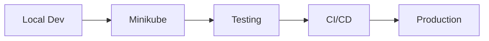

1. **Local Development**
   - Minikube for local K8s cluster
   - Task for command automation
   - Hot reload for development
   - Local image registry

2. **Testing Strategy**
   - Unit tests in CI pipeline
   - Integration tests in Minikube
   - End-to-end tests in staging
   - Performance tests before production

3. **Deployment Strategy**
   - Rolling updates for zero downtime
   - Canary deployments for risk mitigation
   - Automated rollbacks
   - Multi-environment promotion

### 3. Security Considerations

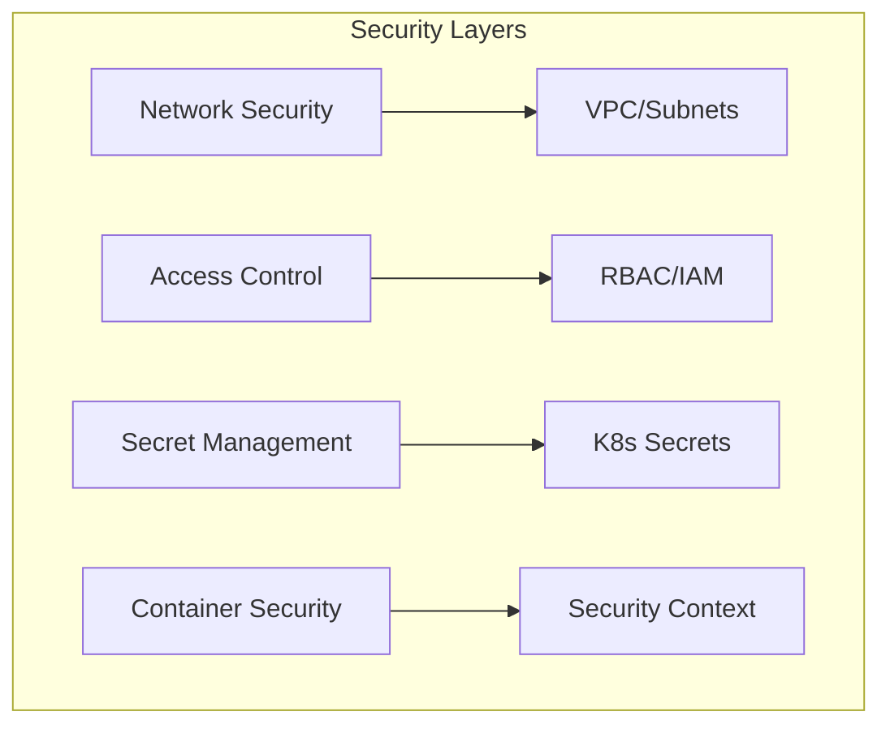

1. **Network Security**
   - Private subnets for workloads
   - Network policies for pod isolation
   - Ingress controllers for traffic management
   - Service mesh (optional)

2. **Access Control**
   - RBAC for Kubernetes resources
   - IAM for AWS services
   - Service accounts for pod identity
   - Least privilege principle

3. **Data Security**
   - Encrypted storage
   - Secrets management
   - TLS for in-transit encryption
   - Regular security scanning

### 4. Scalability Approach

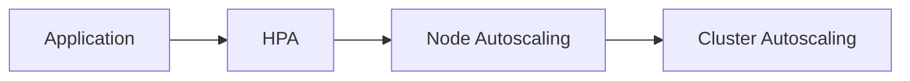

1. **Application Level**
   - Horizontal Pod Autoscaling
   - Resource requests/limits
   - Load balancing
   - Cache strategies

2. **Infrastructure Level**
   - Node autoscaling
   - Multi-AZ deployment
   - Region replication (optional)
   - Database scaling

### 5. Monitoring and Observability

1. **Metrics Collection**
   - Application metrics
   - System metrics
   - Business metrics
   - Custom metrics

2. **Alerting Strategy**
   - Critical alerts
   - Warning alerts
   - Business alerts
   - Escalation policies

### 6. Cost Optimization

1. **Resource Management**
   - Right-sized resources
   - Spot instances where applicable
   - Autoscaling policies
   - Cost monitoring

2. **Storage Optimization**
   - Storage class selection
   - Backup retention policies
   - Log rotation
   - Archive strategies

### 7. Future Considerations

1. **Scalability**
   - Multi-region deployment
   - Global load balancing
   - Data replication
   - Edge caching

2. **Reliability**
   - Chaos engineering
   - Disaster recovery
   - Backup automation
   - SLA monitoring

3. **Security**
   - Zero trust architecture
   - Service mesh
   - Security automation
   - Compliance automation

These design decisions and implementation choices were made to create a solution that is:
- 🚀 Scalable and performant
- 🔒 Secure and compliant
- 💻 Developer-friendly
- 📊 Observable and maintainable
- 💰 Cost-effective
- 🔄 Automated and efficient

## System Reliability Characteristics

### Architecture Overview

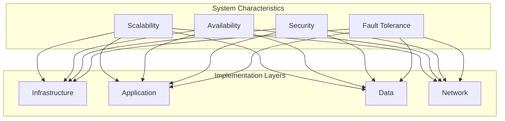

### 1. Scalability Implementation

#### Infrastructure Scalability
```yaml
Kubernetes Cluster:
  Node Autoscaling:
    - Minimum: 3 nodes
    - Maximum: 10 nodes
    - Scale Triggers:
      - CPU utilization > 70%
      - Memory utilization > 80%
  
  Pod Autoscaling:
    - Minimum: 2 replicas
    - Maximum: 10 replicas
    - Metrics:
      - CPU utilization
      - Custom metrics
      - Request rate
```

#### Application Scalability
```yaml
Horizontal Pod Autoscaling:
  Deployment:
    - Rolling updates
    - Zero-downtime scaling
    - Resource quotas
  
  Load Balancing:
    - Service mesh routing
    - Session affinity
    - Connection draining
```

#### Data Layer Scalability
```yaml
Database:
  - Read replicas
  - Connection pooling
  - Query optimization
  - Caching strategy

Cache:
  - Distributed caching
  - Cache invalidation
  - TTL policies
```

### 2. High Availability Design

#### Multi-AZ Architecture
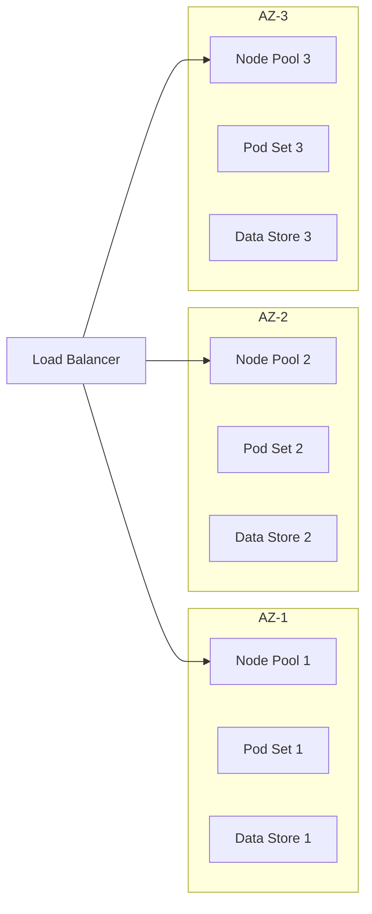

#### Redundancy Implementation
```yaml
Components:
  Control Plane:
    - Multi-master setup
    - Etcd cluster (3+ nodes)
    - Backup control plane
  
  Data Layer:
    - Primary-secondary replication
    - Automated failover
    - Backup strategy
  
  Network:
    - Redundant load balancers
    - Multiple ingress controllers
    - Cross-AZ connectivity
```

### 3. Security Architecture

#### Defense in Depth Strategy
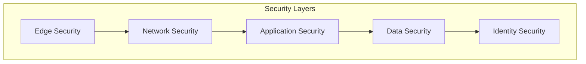

#### Implementation Details
```yaml
Edge Security:
  - WAF rules
  - DDoS protection
  - TLS termination
  - Rate limiting

Network Security:
  - Network policies
  - Security groups
  - Traffic encryption
  - Segmentation

Application Security:
  - Pod security policies
  - RBAC
  - Secret management
  - Container scanning

Data Security:
  - Encryption at rest
  - Encryption in transit
  - Key rotation
  - Access auditing
```

### 4. Fault Tolerance Mechanisms

#### Failure Detection and Recovery
```yaml
Health Checks:
  Liveness Probe:
    - HTTP endpoint check
    - TCP socket check
    - Command execution
  
  Readiness Probe:
    - Service dependency check
    - Resource availability
    - Database connectivity

Circuit Breakers:
  - Connection pooling
  - Timeout configuration
  - Retry policies
  - Fallback mechanisms
```

#### Resilience Patterns
```yaml
Implementation:
  - Retry with exponential backoff
  - Circuit breaker pattern
  - Bulkhead pattern
  - Fallback strategies
  - Graceful degradation
```

### 5. Monitoring and Alerting

#### Metrics Collection
```yaml
System Metrics:
  - Node health
  - Pod status
  - Resource utilization
  - Network performance

Application Metrics:
  - Response times
  - Error rates
  - Request volumes
  - Business metrics

Custom Metrics:
  - SLI measurements
  - Business KPIs
  - User experience
```

#### Alert Configuration
```yaml
Alerting Rules:
  Infrastructure:
    - Node availability < 80%
    - Pod restart count > 5
    - CPU utilization > 85%
    - Memory usage > 90%

  Application:
    - Error rate > 1%
    - P95 latency > 500ms
    - Success rate < 99.9%
    - Concurrent users > threshold
```

### 6. Disaster Recovery

#### Backup Strategy
```yaml
Components:
  Etcd:
    - Scheduled snapshots
    - Cross-region replication
    - Retention policy
  
  Application Data:
    - Regular backups
    - Point-in-time recovery
    - Geographic redundancy
  
  Configuration:
    - GitOps versioning
    - Infrastructure as Code
    - Secret backups
```

#### Recovery Procedures
```yaml
Recovery Plans:
  - RTO: < 4 hours
  - RPO: < 15 minutes
  
Procedures:
  - Automated recovery scripts
  - Manual intervention points
  - Communication plan
  - Escalation path
```

### 7. Performance Optimization

#### Resource Management
```yaml
Optimization Areas:
  Compute:
    - Right-sized containers
    - Efficient scheduling
    - Resource limits
    - QoS classes

  Storage:
    - Storage class selection
    - Volume types
    - Caching layers
    - I/O optimization

  Network:
    - Service mesh optimization
    - Network policies
    - Load balancing
    - Traffic routing
```

### 8. Implementation Best Practices

1. **Scalability**:
   - Use horizontal scaling over vertical
   - Implement proper resource requests/limits
   - Enable metric-based autoscaling
   - Design for statelessness

2. **Availability**:
   - Deploy across multiple AZs
   - Implement proper health checks
   - Use pod disruption budgets
   - Configure proper readiness/liveness probes

3. **Security**:
   - Follow least privilege principle
   - Implement network policies
   - Regular security scanning
   - Automated secret rotation

4. **Fault Tolerance**:
   - Implement circuit breakers
   - Use retry with backoff
   - Enable pod anti-affinity
   - Configure proper timeouts

This implementation ensures:
- 📈 Linear scalability
- 🔄 High availability (99.9%+)
- 🔒 Defense in depth security
- 🛡️ Resilience to failures
- 📊 Comprehensive monitoring
- 🔧 Efficient resource usage

## AWS Production Networking Strategy

### Network Architecture Overview

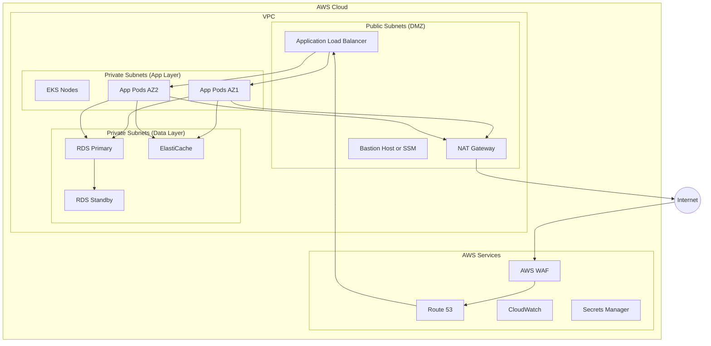

### 1. VPC Design

#### Network Segmentation
```yaml
VPC CIDR: 10.0.0.0/16

Availability Zone A:
  Public Subnet:  10.0.0.0/24
  Private App:    10.0.10.0/24
  Private Data:   10.0.20.0/24

Availability Zone B:
  Public Subnet:  10.0.1.0/24
  Private App:    10.0.11.0/24
  Private Data:   10.0.21.0/24

Availability Zone C:
  Public Subnet:  10.0.2.0/24
  Private App:    10.0.12.0/24
  Private Data:   10.0.22.0/24
```

### 2. Security Layers

1. **Edge Security**
   - AWS WAF for application firewall
   - AWS Shield for DDoS protection
   - CloudFront for CDN and edge security
   - SSL/TLS termination at ALB

2. **Network Access Controls**
   ```hcl
   # Example Security Group for EKS Nodes
   resource "aws_security_group" "eks_nodes" {
     name        = "eks-nodes"
     description = "Security group for EKS nodes"
     vpc_id      = aws_vpc.main.id

     ingress {
       description = "Allow inbound traffic from ALB"
       from_port   = 30000
       to_port     = 32767
       protocol    = "tcp"
       security_groups = [aws_security_group.alb.id]
     }
   }
   ```

### 3. Load Balancing Strategy

1. **External Traffic**
   - Application Load Balancer (ALB) for HTTP/HTTPS
   - AWS WAF integration
   - SSL termination
   - Access logs to S3

2. **Internal Traffic**
   - Service mesh (optional)
   - Internal ALB for service-to-service
   - Network Load Balancer for TCP/UDP

### 4. DNS and Service Discovery

1. **External DNS**
   ```yaml
   Route 53:
     - Public hosted zone for external access
     - Health checks for endpoints
     - Failover routing policies
     - Geolocation routing (optional)
   ```

2. **Internal DNS**
   ```yaml
   CoreDNS (EKS):
     - Service discovery
     - Pod DNS resolution
     - External DNS integration
   ```

### 5. Network Policies

```yaml
# Example Network Policy
apiVersion: networking.k8s.io/v1
kind: NetworkPolicy
metadata:
  name: app-network-policy
spec:
  podSelector:
    matchLabels:
      app: flask-app
  policyTypes:
    - Ingress
    - Egress
  ingress:
    - from:
        - namespaceSelector:
            matchLabels:
              name: monitoring
  egress:
    - to:
        - namespaceSelector:
            matchLabels:
              name: database
```

### 6. Connectivity and VPN

1. **VPN Options**
   - AWS Client VPN for developer access
   - Site-to-Site VPN for hybrid cloud
   - AWS Direct Connect for dedicated connection

2. **Bastion Host**
   - Hardened EC2 instance
   - Jump box for emergency access
   - Audit logging enabled

### 7. Monitoring and Logging

1. **Network Monitoring**
   ```yaml
   VPC Flow Logs:
     - Capture: ACCEPT/REJECT traffic
     - Destination: CloudWatch Logs
     - Retention: 30 days
   ```

2. **Performance Monitoring**
   ```yaml
   CloudWatch Metrics:
     - NetworkIn/NetworkOut
     - ConnectionCount
     - ProcessedBytes
     - HealthyHostCount
   ```

### 8. Cost Optimization

1. **NAT Gateway Strategy**
   - One NAT Gateway per AZ
   - NAT Instance for dev/staging
   - Cost vs. availability trade-off

2. **Data Transfer**
   - Regional data transfer optimization
   - CloudFront for static content
   - S3 Transfer Acceleration

### Implementation Example

```hcl
# VPC Configuration
module "vpc" {
  source = "terraform-aws-modules/vpc/aws"

  name = "production-vpc"
  cidr = "10.0.0.0/16"

  azs             = ["eu-west-1a", "eu-west-1b", "eu-west-1c"]
  private_subnets = ["10.0.10.0/24", "10.0.11.0/24", "10.0.12.0/24"]
  public_subnets  = ["10.0.0.0/24", "10.0.1.0/24", "10.0.2.0/24"]

  enable_nat_gateway     = true
  single_nat_gateway     = false
  one_nat_gateway_per_az = true

  enable_vpn_gateway = true

  tags = {
    Environment = "production"
    Terraform   = "true"
  }
}
```

This networking strategy ensures:
- 🔒 Multi-layer security
- 🌐 High availability
- 📈 Scalability
- 🔍 Network visibility
- 💰 Cost optimization
- 🚀 Performance optimization

## AWS Service Access Implementation

### Access Management Overview

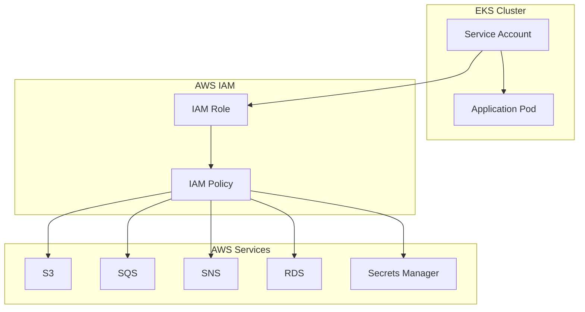

### 1. IRSA (IAM Roles for Service Accounts) Setup

```hcl
# Enable IRSA for EKS Cluster
resource "aws_iam_openid_connect_provider" "eks" {
  url             = aws_eks_cluster.main.identity[0].oidc[0].issuer
  client_id_list  = ["sts.amazonaws.com"]
  thumbprint_list = [data.tls_certificate.eks.certificates[0].sha1_fingerprint]
}

# Create IAM Role for Service Account
resource "aws_iam_role" "app_role" {
  name = "flask-app-role"

  assume_role_policy = jsonencode({
    Version = "2012-10-17"
    Statement = [{
      Action = "sts:AssumeRoleWithWebIdentity"
      Effect = "Allow"
      Principal = {
        Federated = aws_iam_openid_connect_provider.eks.arn
      }
      Condition = {
        StringEquals = {
          "${aws_iam_openid_connect_provider.eks.url}:sub": "system:serviceaccount:${var.namespace}:${var.service_account_name}"
        }
      }
    }]
  })
}
```

### 2. Service-Specific Policies

1. **S3 Access Policy**:
```hcl
resource "aws_iam_role_policy" "s3_access" {
  name = "s3-access"
  role = aws_iam_role.app_role.id

  policy = jsonencode({
    Version = "2012-10-17"
    Statement = [
      {
        Effect = "Allow"
        Action = [
          "s3:GetObject",
          "s3:PutObject",
          "s3:ListBucket"
        ]
        Resource = [
          "${aws_s3_bucket.app_bucket.arn}",
          "${aws_s3_bucket.app_bucket.arn}/*"
        ]
      }
    ]
  })
}
```

2. **Secrets Manager Access**:
```hcl
resource "aws_iam_role_policy" "secrets_access" {
  name = "secrets-access"
  role = aws_iam_role.app_role.id

  policy = jsonencode({
    Version = "2012-10-17"
    Statement = [
      {
        Effect = "Allow"
        Action = [
          "secretsmanager:GetSecretValue",
          "secretsmanager:DescribeSecret"
        ]
        Resource = [
          "arn:aws:secretsmanager:${var.region}:${var.account_id}:secret:${var.environment}/*"
        ]
      }
    ]
  })
}
```

### 3. Kubernetes Service Account

```yaml
apiVersion: v1
kind: ServiceAccount
metadata:
  name: flask-app
  namespace: dev
  annotations:
    eks.amazonaws.com/role-arn: arn:aws:iam::${ACCOUNT_ID}:role/flask-app-role
```

### 4. Pod Security Configuration

```yaml
apiVersion: apps/v1
kind: Deployment
metadata:
  name: flask-app
spec:
  template:
    spec:
      serviceAccountName: flask-app
      securityContext:
        fsGroup: 1000
        runAsUser: 1000
        runAsNonRoot: true
```

### 5. Access Patterns

1. **Direct AWS SDK Access**:
```python
import boto3

# AWS SDK automatically uses IRSA credentials
s3_client = boto3.client('s3')
secret_client = boto3.client('secretsmanager')
```

2. **External Secrets Operator**:
```yaml
apiVersion: external-secrets.io/v1beta1
kind: ExternalSecret
metadata:
  name: app-secrets
spec:
  refreshInterval: "1h"
  secretStoreRef:
    name: aws-secrets-manager
    kind: SecretStore
  target:
    name: app-secrets
  data:
    - secretKey: DB_PASSWORD
      remoteRef:
        key: dev/flask-app/db
        property: password
```

### 6. Security Best Practices

1. **Least Privilege Access**:
   - Scope down permissions to specific resources
   - Use resource tags for fine-grained control
   - Regular access review and cleanup

2. **Secret Rotation**:
   ```hcl
   resource "aws_secretsmanager_secret_rotation" "app" {
     secret_id           = aws_secretsmanager_secret.app.id
     rotation_lambda_arn = aws_lambda_function.rotation.arn

     rotation_rules {
       automatically_after_days = 30
     }
   }
   ```

3. **Access Monitoring**:
   ```yaml
   CloudWatch Logs:
     - API calls through CloudTrail
     - Service account token usage
     - Access denials and errors
   ```

### 7. Implementation Example

```hcl
module "iam_assumable_role_with_oidc" {
  source  = "terraform-aws-modules/iam/aws//modules/iam-assumable-role-with-oidc"
  version = "~> 4.0"

  create_role                   = true
  role_name                     = "flask-app-${var.environment}"
  provider_url                  = replace(aws_eks_cluster.main.identity[0].oidc[0].issuer, "https://", "")
  role_policy_arns             = [aws_iam_policy.app_policy.arn]
  oidc_fully_qualified_subjects = ["system:serviceaccount:${var.namespace}:flask-app"]
}

resource "aws_iam_policy" "app_policy" {
  name        = "flask-app-policy-${var.environment}"
  description = "Policy for Flask application"

  policy = jsonencode({
    Version = "2012-10-17"
    Statement = [
      {
        Effect = "Allow"
        Action = [
          "s3:GetObject",
          "secretsmanager:GetSecretValue",
          "sqs:SendMessage",
          "sns:Publish"
        ]
        Resource = [
          aws_s3_bucket.app_bucket.arn,
          aws_secretsmanager_secret.app.arn,
          aws_sqs_queue.app_queue.arn,
          aws_sns_topic.app_topic.arn
        ]
      }
    ]
  })
}
```

This AWS service access implementation ensures:
- 🔐 Secure service authentication
- 🎯 Fine-grained access control
- 🔄 Automated secret rotation
- 📝 Comprehensive audit logging
- ⚡ Efficient resource access
- 🛡️ Defense in depth

## CI/CD Pipeline for Multi-Environment Deployments

### Pipeline Architecture Overview

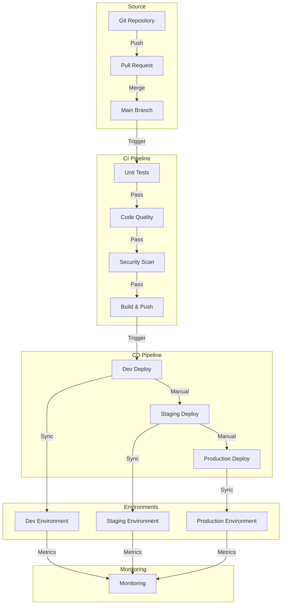

### 1. Pipeline Configuration (GitHub Actions)

```yaml
# .github/workflows/ci-cd.yml
name: CI/CD Pipeline

on:
  push:
    branches: [ main ]
  pull_request:
    branches: [ main ]

env:
  AWS_REGION: us-west-2
  ECR_REPOSITORY: flask-app
  EKS_CLUSTER: main-cluster

jobs:
  test:
    runs-on: ubuntu-latest
    steps:
      - uses: actions/checkout@v3
      - name: Set up Python
        uses: actions/setup-python@v4
        with:
          python-version: '3.9'
      - name: Run Tests
        run: |
          pip install -r requirements.txt
          python -m pytest tests/

  security-scan:
    needs: test
    runs-on: ubuntu-latest
    steps:
      - uses: actions/checkout@v3
      - name: Run Trivy vulnerability scanner
        uses: aquasecurity/trivy-action@master
        with:
          scan-type: 'fs'
          ignore-unfixed: true
          format: 'sarif'
          severity: 'CRITICAL,HIGH'

  build:
    needs: security-scan
    runs-on: ubuntu-latest
    steps:
      - name: Configure AWS credentials
        uses: aws-actions/configure-aws-credentials@v1
        with:
          aws-access-key-id: ${{ secrets.AWS_ACCESS_KEY_ID }}
          aws-secret-access-key: ${{ secrets.AWS_SECRET_ACCESS_KEY }}
          aws-region: ${{ env.AWS_REGION }}
      
      - name: Build and push
        run: |
          aws ecr get-login-password --region $AWS_REGION | docker login --username AWS --password-stdin $ECR_REPOSITORY
          docker build -t $ECR_REPOSITORY:$GITHUB_SHA .
          docker push $ECR_REPOSITORY:$GITHUB_SHA

  deploy-dev:
    needs: build
    runs-on: ubuntu-latest
    environment: development
    steps:
      - name: Deploy to Dev
        run: |
          aws eks update-kubeconfig --name $EKS_CLUSTER --region $AWS_REGION
          helm upgrade --install flask-app ./helm/flask-app \
            --namespace dev \
            --set image.tag=$GITHUB_SHA \
            --values ./helm/flask-app/values-dev.yaml

  deploy-staging:
    needs: deploy-dev
    runs-on: ubuntu-latest
    environment: staging
    steps:
      - name: Deploy to Staging
        run: |
          aws eks update-kubeconfig --name $EKS_CLUSTER --region $AWS_REGION
          helm upgrade --install flask-app ./helm/flask-app \
            --namespace staging \
            --set image.tag=$GITHUB_SHA \
            --values ./helm/flask-app/values-staging.yaml

  deploy-prod:
    needs: deploy-staging
    runs-on: ubuntu-latest
    environment: production
    steps:
      - name: Deploy to Production
        run: |
          aws eks update-kubeconfig --name $EKS_CLUSTER --region $AWS_REGION
          helm upgrade --install flask-app ./helm/flask-app \
            --namespace prod \
            --set image.tag=$GITHUB_SHA \
            --values ./helm/flask-app/values-prod.yaml
```

### 2. Environment-Specific Configurations

1. **Helm Values Files**:
```yaml
# values-dev.yaml
environment: dev
replicaCount: 1
resources:
  limits:
    cpu: 200m
    memory: 256Mi

# values-staging.yaml
environment: staging
replicaCount: 2
resources:
  limits:
    cpu: 500m
    memory: 512Mi

# values-prod.yaml
environment: prod
replicaCount: 3
resources:
  limits:
    cpu: 1000m
    memory: 1Gi
```

2. **Environment Variables**:
```yaml
# .github/workflows/env/dev.yml
env:
  LOG_LEVEL: DEBUG
  MONITORING_ENABLED: true
  ALERT_THRESHOLD: high

# .github/workflows/env/prod.yml
env:
  LOG_LEVEL: INFO
  MONITORING_ENABLED: true
  ALERT_THRESHOLD: medium
```

### 3. Deployment Strategy

1. **Progressive Deployment**:
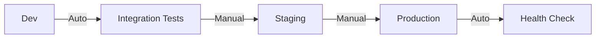

2. **Rollback Strategy**:
```yaml
# Automated Rollback Configuration
helm:
  rollback:
    enabled: true
    timeout: 300
    cleanup: true
    force: true
    recreate: true
```

### 4. Security and Compliance

1. **Secret Management**:
```yaml
# GitHub Actions Secrets
secrets:
  AWS_ACCESS_KEY_ID: ${{ secrets.AWS_ACCESS_KEY_ID }}
  AWS_SECRET_ACCESS_KEY: ${{ secrets.AWS_SECRET_ACCESS_KEY }}
  DOCKER_USERNAME: ${{ secrets.DOCKER_USERNAME }}
  DOCKER_PASSWORD: ${{ secrets.DOCKER_PASSWORD }}
```

2. **Security Scanning**:
```yaml
# Security Scan Configuration
security:
  vulnerabilityScanning:
    enabled: true
    blockers:
      - critical
      - high
  containerScanning:
    enabled: true
  secretScanning:
    enabled: true
```

### 5. Monitoring and Alerts

1. **Pipeline Metrics**:
```yaml
metrics:
  - name: deployment_duration
    type: gauge
    labels:
      - environment
      - status
  - name: test_coverage
    type: gauge
    labels:
      - component
```

2. **Alert Configuration**:
```yaml
alerts:
  - name: DeploymentFailed
    severity: critical
    condition: deployment_duration > 600
    notification:
      slack: "#deployments"
      email: "devops@company.com"
```

### 6. Automation Scripts

1. **Deployment Verification**:
```bash
#!/bin/bash
# verify-deployment.sh

check_deployment() {
    kubectl rollout status deployment/flask-app -n $ENVIRONMENT
    if [ $? -ne 0 ]; then
        echo "Deployment failed"
        exit 1
    fi
}

check_health() {
    curl -f http://$SERVICE_URL/health/live
    if [ $? -ne 0 ]; then
        echo "Health check failed"
        exit 1
    fi
}

main() {
    check_deployment
    check_health
}

main
```

2. **Environment Setup**:
```bash
#!/bin/bash
# setup-environment.sh

setup_namespace() {
    kubectl create namespace $ENVIRONMENT
    kubectl label namespace $ENVIRONMENT environment=$ENVIRONMENT
}

setup_monitoring() {
    helm upgrade --install prometheus prometheus-community/kube-prometheus-stack \
        --namespace monitoring-$ENVIRONMENT \
        --values monitoring-values-$ENVIRONMENT.yaml
}

main() {
    setup_namespace
    setup_monitoring
}

main
```

### 7. Best Practices

1. **Version Control**:
   - Branch protection rules
   - Required reviews
   - Automated testing
   - Version tagging

2. **Testing Strategy**:
   - Unit tests before build
   - Integration tests in dev
   - Load tests in staging
   - Smoke tests in production

3. **Security Measures**:
   - Scan dependencies
   - Container scanning
   - Infrastructure scanning
   - Compliance checks

4. **Documentation**:
   - Automated changelog
   - Deployment history
   - Environment differences
   - Runbook automation

This CI/CD implementation ensures:
- 🚀 Automated deployments
- 🔄 Consistent environments
- 🔒 Secure pipelines
- 📊 Comprehensive monitoring
- 🔧 Easy maintenance
- ⚡ Quick rollbacks

## Solution Trade-offs and Design Considerations

### Architecture Trade-offs Overview

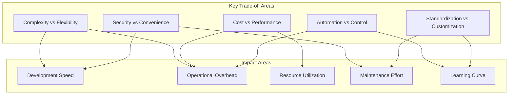

### 1. Infrastructure Choices

#### Kubernetes vs. Traditional Deployment
👍 **Benefits**:
- Container orchestration and scaling
- Declarative configuration
- Self-healing capabilities
- Portable across clouds

👎 **Drawbacks**:
- Higher operational complexity
- Steeper learning curve
- Resource overhead for small applications
- Higher initial setup cost

**Decision Rationale**: Chose Kubernetes for long-term scalability and standardization, accepting the initial complexity overhead.

#### Minikube for Local Development
👍 **Benefits**:
- Simplified local K8s setup
- Matches production environment
- Built-in addons and tools
- Low resource requirements

👎 **Drawbacks**:
- Limited multi-node testing
- Performance differences from production
- Some features not available
- Additional tool dependencies

**Decision Rationale**: Selected Minikube for developer experience and environment parity, while acknowledging its limitations.

### 2. Monitoring Stack

#### Prometheus + Grafana vs. Cloud-Native Solutions
👍 **Benefits**:
- Open-source and customizable
- Rich ecosystem of exporters
- Cloud-agnostic monitoring
- Cost-effective at scale

👎 **Drawbacks**:
- Self-managed infrastructure
- Storage considerations
- Query language learning curve
- Alert configuration complexity

**Decision Rationale**: Implemented Prometheus/Grafana for flexibility and cost control, accepting the operational overhead.

### 3. CI/CD Implementation

#### GitHub Actions vs. Jenkins
👍 **Benefits**:
- Tight SCM integration
- Managed infrastructure
- YAML-based configuration
- Built-in secrets management

👎 **Drawbacks**:
- Limited customization
- Platform lock-in
- Usage-based pricing
- Limited local testing

**Decision Rationale**: Chose GitHub Actions for simplicity and integration, trading some flexibility for operational efficiency.

### 4. Security Approach

#### IRSA vs. Static Credentials
👍 **Benefits**:
- Dynamic credential management
- Fine-grained access control
- Automated rotation
- Audit trail

👎 **Drawbacks**:
- Complex initial setup
- Cloud provider specific
- Troubleshooting complexity
- Additional IAM overhead

**Decision Rationale**: Implemented IRSA for enhanced security, accepting the additional setup and maintenance complexity.

### 5. Configuration Management

#### Helm vs. Raw Kubernetes Manifests
👍 **Benefits**:
- Template-based configuration
- Version management
- Release rollback
- Package distribution

👎 **Drawbacks**:
- Template debugging complexity
- Additional abstraction layer
- Version compatibility issues
- Learning curve for teams

**Decision Rationale**: Adopted Helm for maintainable and versioned deployments, despite the additional complexity.

### 6. Development Workflow

#### Task-based vs. Direct Commands
👍 **Benefits**:
- Standardized commands
- Documentation as code
- Cross-platform support
- Reduced human error

👎 **Drawbacks**:
- Additional tool dependency
- Maintenance overhead
- Abstraction complexity
- Learning requirement

**Decision Rationale**: Implemented Task for command standardization, accepting the additional tool dependency.

### 7. Resource Management

#### Resource Limits vs. Autoscaling
👍 **Benefits**:
- Predictable resource usage
- Cost control
- Performance boundaries
- Cluster stability

👎 **Drawbacks**:
- Potential resource waste
- Manual tuning required
- Less flexibility
- Over-provisioning risk

**Decision Rationale**: Combined both approaches with conservative limits and targeted autoscaling.

### 8. Environment Strategy

#### Multiple Clusters vs. Namespaces
👍 **Benefits**:
- Strong isolation
- Independent scaling
- Resource separation
- Maintenance flexibility

👎 **Drawbacks**:
- Higher infrastructure cost
- Operational complexity
- Resource duplication
- Management overhead

**Decision Rationale**: Used namespaces for cost-efficiency in development, separate clusters for production.

### Impact Analysis

1. **Development Velocity**:
   ```yaml
   Positive Impacts:
     - Standardized workflows
     - Automated deployments
     - Local environment parity
   
   Negative Impacts:
     - Initial setup time
     - Learning curve
     - Tool complexity
   ```

2. **Operational Overhead**:
   ```yaml
   Positive Impacts:
     - Automated management
     - Centralized monitoring
     - Standardized processes
   
   Negative Impacts:
     - Infrastructure maintenance
     - Multiple tools to manage
     - Debugging complexity
   ```

3. **Cost Implications**:
   ```yaml
   Positive Impacts:
     - Resource optimization
     - Scaling efficiency
     - Tool consolidation
   
   Negative Impacts:
     - Infrastructure costs
     - Tool licensing
     - Training requirements
   ```

### Mitigation Strategies

1. **Complexity Management**:
   - Comprehensive documentation
   - Automated setup scripts
   - Regular training sessions
   - Simplified local development

2. **Cost Control**:
   - Resource usage monitoring
   - Automated scaling policies
   - Development environment optimization
   - Tool consolidation

3. **Security Balance**:
   - Automated security processes
   - Developer-friendly tools
   - Regular security reviews
   - Clear security guidelines

4. **Maintenance Efficiency**:
   - Automated updates
   - Centralized configuration
   - Monitoring automation
   - Regular health checks

These trade-offs were carefully considered to create a solution that is:
- 🎯 Balanced for current needs
- 📈 Scalable for future growth
- 🛠️ Maintainable long-term
- 💰 Cost-effective
- 🔒 Secure by design
- 👥 Team-friendly

## Future Enhancements and Improvements

### Overview of Enhancement Areas

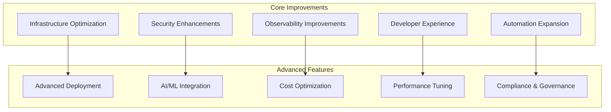

### 1. Infrastructure Enhancements

#### Multi-Region Support
```yaml
Implementation:
  - Global load balancing
  - Cross-region data replication
  - Regional failover automation
  - Latency-based routing

Benefits:
  - Improved availability
  - Disaster recovery
  - Better user experience
  - Geographic compliance
```

#### Service Mesh Integration
```yaml
Features:
  - Advanced traffic management
  - Service-to-service encryption
  - Detailed telemetry
  - Circuit breaking

Tools:
  - Istio/Linkerd deployment
  - Envoy proxy integration
  - mTLS implementation
  - Traffic policies
```

### 2. Security Improvements

#### Zero Trust Architecture
```yaml
Components:
  - Identity-based access
  - Just-in-time access
  - Micro-segmentation
  - Continuous verification

Implementation:
  - Service mesh security
  - Pod identity enforcement
  - Network policy enhancement
  - Behavioral monitoring
```

#### Advanced Threat Protection
```yaml
Features:
  - Runtime security monitoring
  - Automated threat response
  - Container image scanning
  - Kubernetes audit logging

Tools:
  - Falco integration
  - OPA/Gatekeeper policies
  - Aqua/Twistlock security
  - EFK stack for audit logs
```

### 3. Observability Enhancements

#### Distributed Tracing
```yaml
Implementation:
  - OpenTelemetry integration
  - Trace sampling configuration
  - Context propagation
  - Span correlation

Components:
  - Jaeger deployment
  - Tempo integration
  - Trace visualization
  - Performance analysis
```

#### Advanced Monitoring
```yaml
Features:
  - Custom metric collection
  - Business KPI tracking
  - ML-based anomaly detection
  - Automated root cause analysis

Tools:
  - Prometheus recording rules
  - Custom exporters
  - AlertManager enhancements
  - Grafana dashboards
```

### 4. Developer Experience

#### GitOps Enhancement
```yaml
Implementation:
  - ArgoCD/Flux deployment
  - Application of Apps pattern
  - Automated sync policies
  - Drift detection

Features:
  - Self-service deployments
  - Environment promotion
  - Configuration validation
  - Rollback automation
```

#### Local Development
```yaml
Improvements:
  - Development container support
  - Hot reload capabilities
  - Local service virtualization
  - Automated setup scripts

Tools:
  - DevSpace/Tilt integration
  - Telepresence for debugging
  - Skaffold automation
  - VSCode extensions
```

### 5. Performance Optimization

#### Caching Strategy
```yaml
Implementation:
  - Multi-level caching
  - Cache warming
  - Intelligent invalidation
  - Cache analytics

Components:
  - Redis cluster
  - CDN integration
  - Browser caching
  - API caching
```

#### Resource Optimization
```yaml
Features:
  - Vertical pod autoscaling
  - Cost-based scheduling
  - Resource right-sizing
  - Spot instance integration

Tools:
  - VPA operator
  - Goldilocks integration
  - Cost monitoring
  - Spot instance manager
```

### 6. Compliance and Governance

#### Policy Enforcement
```yaml
Implementation:
  - OPA/Gatekeeper policies
  - Admission controllers
  - Compliance monitoring
  - Audit logging

Policies:
  - Resource quotas
  - Security standards
  - Cost limits
  - Naming conventions
```

#### Automated Compliance
```yaml
Features:
  - Compliance scanning
  - Automated reporting
  - Policy violation alerts
  - Remediation automation

Standards:
  - SOC2 compliance
  - HIPAA requirements
  - GDPR compliance
  - PCI DSS standards
```

### 7. AI/ML Integration

#### Intelligent Operations
```yaml
Features:
  - Predictive scaling
  - Anomaly detection
  - Automated troubleshooting
  - Performance prediction

Implementation:
  - ML model deployment
  - Training pipelines
  - Feature engineering
  - Model monitoring
```

#### ChatOps Integration
```yaml
Features:
  - Slack/Teams integration
  - Natural language commands
  - Automated responses
  - Incident management

Tools:
  - Bot framework
  - NLP processing
  - Workflow automation
  - Knowledge base
```

### 8. Cost Management

#### FinOps Implementation
```yaml
Features:
  - Cost allocation
  - Budget monitoring
  - Usage optimization
  - Chargeback reporting

Tools:
  - Kubecost integration
  - AWS Cost Explorer
  - Resource tagging
  - Cost forecasting
```

### Implementation Priority Matrix

1. **High Priority (0-3 months)**:
   - Service mesh integration
   - Distributed tracing
   - GitOps implementation
   - Resource optimization

2. **Medium Priority (3-6 months)**:
   - Multi-region support
   - Advanced monitoring
   - Policy enforcement
   - Caching strategy

3. **Long-term (6+ months)**:
   - AI/ML integration
   - Zero trust architecture
   - Automated compliance
   - FinOps implementation

### Expected Benefits

1. **Operational Improvements**:
   - Reduced MTTR
   - Improved reliability
   - Better scalability
   - Enhanced security

2. **Business Impact**:
   - Lower operational costs
   - Faster time to market
   - Better user experience
   - Increased compliance

3. **Team Efficiency**:
   - Simplified operations
   - Reduced toil
   - Better visibility
   - Faster debugging

These enhancements will help create a solution that is:
- 🚀 More scalable and resilient
- 🔒 More secure and compliant
- 📊 Better monitored and managed
- 💰 More cost-effective
- 🔧 Easier to maintain
- 👥 More developer-friendly

## Additional Implementation Details

### 1. Advanced Monitoring Implementation

#### Prometheus Stack Configuration
```yaml
# values-monitoring.yaml
prometheus:
  prometheusSpec:
    retention: 15d
    resources:
      requests:
        memory: 512Mi
        cpu: 500m
      limits:
        memory: 2Gi
        cpu: 1000m
    
    storageSpec:
      volumeClaimTemplate:
        spec:
          storageClassName: gp2
          resources:
            requests:
              storage: 50Gi

    additionalScrapeConfigs:
      - job_name: 'flask-app-metrics'
        kubernetes_sd_configs:
          - role: pod
        relabel_configs:
          - source_labels: [__meta_kubernetes_pod_label_app]
            regex: flask-app
            action: keep

alertmanager:
  config:
    global:
      resolve_timeout: 5m
    route:
      group_by: ['alertname', 'cluster', 'service']
      group_wait: 30s
      group_interval: 5m
      repeat_interval: 12h
      receiver: 'slack'
      routes:
        - match:
            severity: critical
          receiver: 'pagerduty'
    receivers:
      - name: 'slack'
        slack_configs:
          - channel: '#alerts'
            send_resolved: true
      - name: 'pagerduty'
        pagerduty_configs:
          - service_key: '<key>'
```

#### Custom Grafana Dashboards
```yaml
# flask-app-dashboard.json
{
  "dashboard": {
    "title": "Flask Application Metrics",
    "panels": [
      {
        "title": "Request Rate",
        "type": "graph",
        "targets": [
          {
            "expr": "rate(http_requests_total[5m])",
            "legendFormat": "{{method}} {{path}}"
          }
        ]
      },
      {
        "title": "Response Times",
        "type": "heatmap",
        "targets": [
          {
            "expr": "rate(http_request_duration_seconds_bucket[5m])"
          }
        ]
      },
      {
        "title": "Error Rate",
        "type": "graph",
        "targets": [
          {
            "expr": "rate(http_requests_total{status=~\"5..\"}[5m])"
          }
        ]
      }
    ]
  }
}
```

### 2. Helm Chart Reusability

#### Common Chart Structure
```yaml
# charts/common/templates/_helpers.tpl
{{- define "common.labels" -}}
app.kubernetes.io/name: {{ .Chart.Name }}
app.kubernetes.io/instance: {{ .Release.Name }}
app.kubernetes.io/version: {{ .Chart.AppVersion | quote }}
app.kubernetes.io/managed-by: {{ .Release.Service }}
{{- end -}}

{{- define "common.selectorLabels" -}}
app.kubernetes.io/name: {{ .Chart.Name }}
app.kubernetes.io/instance: {{ .Release.Name }}
{{- end -}}

# charts/common/templates/_deployment.tpl
{{- define "common.deployment" -}}
apiVersion: apps/v1
kind: Deployment
metadata:
  name: {{ include "common.fullname" . }}
  labels:
    {{- include "common.labels" . | nindent 4 }}
spec:
  replicas: {{ .Values.replicaCount }}
  selector:
    matchLabels:
      {{- include "common.selectorLabels" . | nindent 6 }}
  template:
    metadata:
      labels:
        {{- include "common.selectorLabels" . | nindent 8 }}
    spec:
      containers:
        - name: {{ .Chart.Name }}
          image: "{{ .Values.image.repository }}:{{ .Values.image.tag }}"
          imagePullPolicy: {{ .Values.image.pullPolicy }}
          {{- with .Values.resources }}
          resources:
            {{- toYaml . | nindent 12 }}
          {{- end }}
{{- end -}}
```

#### Application-Specific Chart
```yaml
# charts/flask-app/templates/deployment.yaml
{{- include "common.deployment" . -}}

# charts/flask-app/values.yaml
replicaCount: 2
image:
  repository: flask-app
  tag: latest
  pullPolicy: IfNotPresent
resources:
  limits:
    cpu: 200m
    memory: 256Mi
  requests:
    cpu: 100m
    memory: 128Mi
```

### 3. Terraform Module Reusability

#### Base Infrastructure Module
```hcl
# modules/base-infrastructure/main.tf
module "vpc" {
  source = "terraform-aws-modules/vpc/aws"
  version = "~> 3.0"

  name = var.vpc_name
  cidr = var.vpc_cidr

  azs             = var.availability_zones
  private_subnets = var.private_subnet_cidrs
  public_subnets  = var.public_subnet_cidrs

  enable_nat_gateway = true
  single_nat_gateway = var.environment != "production"

  tags = var.tags
}

module "eks" {
  source = "terraform-aws-modules/eks/aws"
  version = "~> 18.0"

  cluster_name    = var.cluster_name
  cluster_version = var.kubernetes_version

  vpc_id     = module.vpc.vpc_id
  subnet_ids = module.vpc.private_subnets

  eks_managed_node_groups = var.node_groups

  tags = var.tags
}

# modules/base-infrastructure/variables.tf
variable "environment" {
  type = string
}

variable "vpc_name" {
  type = string
}

variable "vpc_cidr" {
  type = string
}

variable "availability_zones" {
  type = list(string)
}

# ... more variables
```

#### Environment-Specific Configuration
```hcl
# environments/dev/main.tf
module "dev_infrastructure" {
  source = "../../modules/base-infrastructure"

  environment = "dev"
  vpc_name    = "dev-vpc"
  vpc_cidr    = "10.0.0.0/16"
  
  availability_zones = ["us-west-2a", "us-west-2b"]
  
  node_groups = {
    general = {
      desired_size = 2
      min_size     = 1
      max_size     = 3
      instance_types = ["t3.medium"]
    }
  }

  tags = {
    Environment = "dev"
    Terraform   = "true"
  }
}
```

### 4. Comprehensive Health Checks

#### Application Health Checks
```python
# health_checks.py
from flask import Blueprint, jsonify
import psutil
import requests

health = Blueprint('health', __name__)

@health.route('/health/live')
def liveness():
    return jsonify({
        'status': 'UP',
        'timestamp': datetime.now().isoformat()
    })

@health.route('/health/ready')
def readiness():
    checks = {
        'database': check_database(),
        'cache': check_redis(),
        'disk': check_disk_usage(),
        'memory': check_memory_usage()
    }
    
    status = 'UP' if all(v['status'] == 'UP' for v in checks.values()) else 'DOWN'
    return jsonify({
        'status': status,
        'checks': checks
    }), 200 if status == 'UP' else 503

def check_database():
    try:
        db.session.execute('SELECT 1')
        return {'status': 'UP'}
    except Exception as e:
        return {'status': 'DOWN', 'error': str(e)}

def check_redis():
    try:
        redis_client.ping()
        return {'status': 'UP'}
    except Exception as e:
        return {'status': 'DOWN', 'error': str(e)}

def check_disk_usage():
    disk = psutil.disk_usage('/')
    return {
        'status': 'UP' if disk.percent < 90 else 'DOWN',
        'details': {
            'total': disk.total,
            'used': disk.used,
            'free': disk.free,
            'percent': disk.percent
        }
    }

def check_memory_usage():
    memory = psutil.virtual_memory()
    return {
        'status': 'UP' if memory.percent < 90 else 'DOWN',
        'details': {
            'total': memory.total,
            'available': memory.available,
            'percent': memory.percent
        }
    }
```

#### Kubernetes Probes
```yaml
# deployment.yaml
spec:
  template:
    spec:
      containers:
        - name: flask-app
          livenessProbe:
            httpGet:
              path: /health/live
              port: http
            initialDelaySeconds: 30
            periodSeconds: 10
            timeoutSeconds: 5
            failureThreshold: 3
          readinessProbe:
            httpGet:
              path: /health/ready
              port: http
            initialDelaySeconds: 5
            periodSeconds: 10
            timeoutSeconds: 5
            successThreshold: 1
            failureThreshold: 3
          startupProbe:
            httpGet:
              path: /health/live
              port: http
            failureThreshold: 30
            periodSeconds: 10
```

### 5. Additional Bonus Features

#### Custom Resource Metrics
```yaml
# custom-metrics.yaml
apiVersion: monitoring.coreos.com/v1
kind: ServiceMonitor
metadata:
  name: flask-app
spec:
  selector:
    matchLabels:
      app: flask-app
  endpoints:
    - port: metrics
      interval: 15s
      path: /metrics

---
apiVersion: monitoring.coreos.com/v1
kind: PrometheusRule
metadata:
  name: flask-app-alerts
spec:
  groups:
    - name: flask-app
      rules:
        - alert: HighErrorRate
          expr: rate(http_requests_total{status=~"5.."}[5m]) > 1
          for: 5m
          labels:
            severity: critical
          annotations:
            summary: High error rate detected
```

#### Automated Backup Solution
```yaml
# backup-cronjob.yaml
apiVersion: batch/v1beta1
kind: CronJob
metadata:
  name: backup-job
spec:
  schedule: "0 2 * * *"
  jobTemplate:
    spec:
      template:
        spec:
          containers:
            - name: backup
              image: backup-tool
              env:
                - name: BACKUP_BUCKET
                  value: "my-backup-bucket"
                - name: AWS_REGION
                  value: "us-west-2"
              command:
                - /backup.sh
          restartPolicy: OnFailure
```

#### Service Mesh Integration
```yaml
# istio-config.yaml
apiVersion: networking.istio.io/v1alpha3
kind: VirtualService
metadata:
  name: flask-app
spec:
  hosts:
    - flask-app
  http:
    - route:
        - destination:
            host: flask-app
            subset: v1
          weight: 90
        - destination:
            host: flask-app
            subset: v2
          weight: 10
---
apiVersion: networking.istio.io/v1alpha3
kind: DestinationRule
metadata:
  name: flask-app
spec:
  host: flask-app
  trafficPolicy:
    loadBalancer:
      simple: ROUND_ROBIN
    connectionPool:
      tcp:
        maxConnections: 100
      http:
        http1MaxPendingRequests: 1
        maxRequestsPerConnection: 1
    outlierDetection:
      consecutive5xxErrors: 5
      interval: 30s
      baseEjectionTime: 30s
```

These implementations provide:
- 📊 Comprehensive monitoring
- ♻️ Reusable infrastructure components
- 🏥 Robust health checking
- 🔄 Automated operations
- 🛡️ Enhanced security
- 📈 Scalability features

